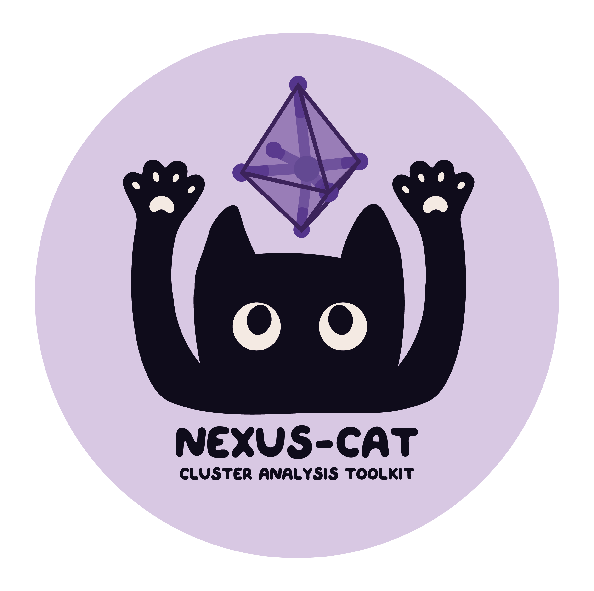

<div align="center">

# NEXUS-CAT
##### Cluster Analysis Toolkit
[](https://opensource.org/licenses/MIT)
[](https://badge.fury.io/py/nexus-cat)
[](https://nexus-cat.readthedocs.io/en/latest/)


</div>

logo made by [Lisap](https://lisaperradinportfolio.framer.website/)

## ⇁ TOC
- [NEXUS-CAT](#nexus-cat)
        - [Cluster Analysis Toolkit](#cluster-analysis-toolkit)
  - [⇁ TOC](#-toc)
  - [⇁ Description and features](#-description-and-features)
  - [⇁ Installation](#-installation)
  - [⇁ Getting started](#-getting-started)
  - [⇁ Documentation](#-documentation)
  - [⇁ Contributing](#-contributing)
  - [⇁ License](#-license)

## ⇁ Description and features

`nexus-cat` is a Python package for analyzing clusters in atomistic simulation trajectories, with a focus on percolation theory and complex network analysis. It provides a flexible and extensible framework for identifying and characterizing clusters based on various criteria.

**Key Features**:

* **Multiple Clustering Strategies**: `nexus-cat` supports several strategies for defining clusters:
    * **Distance Strategy**: Connects nodes based on a simple distance cutoff.
    * **Bonding Strategy**: Identifies clusters based on a three-node bonding pattern (e.g., Si-O-Si).
    * **Coordination Strategy**: Extends the bonding pattern by adding constraints on the coordination number of the nodes.
    * **Shared Strategy**: A more advanced strategy that connects nodes based on a minimum number of shared neighbors, useful for analyzing polyhedral linkages.
* **Percolation Analysis**: The package can calculate a variety of properties related to percolation theory:
    * Average cluster size
    * Largest and spanning cluster sizes
    * Gyration radius and correlation length
    * Percolation probability and order parameter
* **Flexible Configuration**: `nexus-cat` uses a builder pattern with dataclasses for clear and safe configuration, allowing for easy customization of analysis parameters.
* **Efficient I/O**: The package includes readers for common trajectory formats like XYZ and LAMMPS, with efficient scanning and parsing capabilities.

## ⇁ Installation

### Basic installation

To install `nexus-cat` as a package, you can use pip:

```bash
pip install nexus-cat
```

Note: the package does not auto upgrade itself, please run the following command to upgrade to the latest version:

```bash
pip install nexus-cat --upgrade
```

### Installation from the source code

If you want to install the package from the source code to implement your extensions for example, you can clone the repository:

```bash
git clone git@github.com:jperradin/nexus.git
```

Then install the package in development mode:

```bash
cd nexus
pip install -e .
```

## ⇁ Getting started

As a first example you can follow the steps of the [Getting started](https://nexus-cat.readthedocs.io/en/latest/getting_started.html) section of the documentation.

## ⇁ Documentation

The documentation is available [here](https://nexus-cat.readthedocs.io/en/latest/)

## ⇁ Contributing

Contributions to `Nexus-CAT` are welcome! You can contribute by submitting bug reports, feature requests, new extension requests, or pull requests through GitHub.

## ⇁ License

This project is licensed under the [MIT License](https://opensource.org/licenses/MIT).

