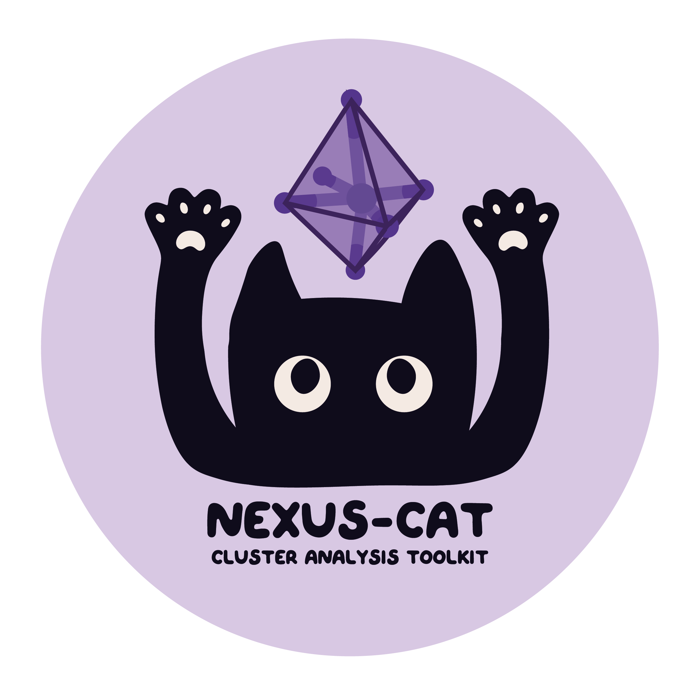

<div align="center">

# NEXUS-CAT
##### Cluster Analysis Toolkit
[](https://opensource.org/licenses/MIT)
[](https://badge.fury.io/py/nexus-cat)
[](https://nexus-cat.readthedocs.io/en/latest/)


</div>

logo made by [Lisap](https://lisaperradinportfolio.framer.website/)

## Table of contents
- [Who is this for?](#who-is-this-for)
- [Description and features](#description-and-features)
- [Installation](#installation)
- [Getting started](#getting-started)
- [Workflow](#workflow)
- [Project structure](#project-structure)
- [Documentation](#documentation)
- [How to cite](#how-to-cite)
- [Notes](#notes)
- [License](#license)


## Who is this for?

`nexus-cat` is designed for researchers, scientists, and students in computational materials science, condensed matter physics, and physical chemistry. It is particularly well-suited for those who:

* Work with atomistic simulation data from molecular dynamics (MD) or Monte Carlo (MC) simulations, in **XYZ** or **LAMMPS** formats.
* Study phenomena related to **percolation theory**, such as the determination of percolation thresholds and critical exponents.
* Investigate the structure of **disordered materials** and networks. The clustering strategies can analyze complex connectivity patterns, like polyhedral linkages in silicate networks.
* Need to characterize the formation and properties of clusters, aggregates, or networks in their systems.


## Description and features

`nexus-cat` offers a suite of tools for network and cluster analysis, with a strong focus on percolation theory.

---

### Clustering strategies

Four clustering strategies define how connections between nodes are established to form clusters. The strategy is automatically selected based on the `ClusteringSettings` configuration.

| Strategy | Criterion | Description |
|---|---|---|
| **Distance** | `"distance"` | Connects any two nodes within a cutoff distance. Uses a 2-element connectivity (e.g., `["Si", "Si"]`). |
| **Bonding** | `"bond"` | Identifies clusters via a three-node bridging pattern (e.g., `["Si", "O", "Si"]`). Connects two networking nodes if they share a common bridging node. |
| **Coordination** | `"bond"` + `with_coordination_number` | Extends the bonding strategy with constraints on the coordination number of the connected nodes. Supports `pairwise`, `mixing`, and `alternating` modes. |
| **Shared** | `"bond"` + `with_number_of_shared` | Extends coordination-based clustering by requiring nodes to share a minimum number of common bridging neighbors. Distinguishes between corner-, edge-, or face-sharing linkages. |

Strategy selection follows a priority order:
1. **Coordination** if `with_coordination_number` is set (and `with_number_of_shared` is not)
2. **Shared** if `with_number_of_shared` is set
3. **Distance** if `criterion="distance"`
4. **Bonding** if `criterion="bond"`

All strategies use **union-find with path compression** for cluster construction, and **KD-tree** spatial queries (via SciPy `cKDTree`) for neighbor searching with periodic boundary condition support.

---

### Analyzers

Nine analyzers quantify cluster properties. All operate per-frame, compute ensemble averages on finalization, and export results to CSV files.

| Analyzer | Metric | Description |
|---|---|---|
| **AverageClusterSize** | $\langle S \rangle$ | Weight-average cluster size: $\langle S \rangle = \sum_s s^2 n_s / \sum_s s\, n_s$. Percolating clusters are excluded. |
| **LargestClusterSize** | $S_\text{max}$ | Size of the largest cluster per frame, regardless of percolation status. |
| **SpanningClusterSize** | $S_\text{span}$ | Size of the largest non-percolating (finite) cluster. |
| **GyrationRadius** | $R_g$ | RMS radius of gyration, computed from unwrapped coordinates to correctly handle periodic boundaries. Binned by cluster size. |
| **CorrelationLength** | $\xi$ | Characteristic length scale from the second moment of the gyration radius distribution. |
| **PercolationProbability** | $\Pi$ | Fraction of frames containing a cluster that spans the simulation box in all three dimensions. Uses a period-vector algorithm. |
| **OrderParameter** | $P_\infty$ | Fraction of networking nodes belonging to a percolating cluster, computed per dimension. |
| **Concentration** | $c$ | Ratio of networking nodes to total nodes per connectivity. |
| **ClusterSizeDistribution** | $n_s$ | Histogram of cluster sizes per connectivity. |

---

### Percolation detection

Percolation is detected using the **period-vector algorithm** ([Livraghi et al. 2021](https://doi.org/10.1021/acs.jctc.1c00423)):

1. During BFS unwrapping of cluster positions, revisiting an already-visited node across a periodic boundary produces a **period vector**.
2. The **rank** of the period vector matrix (via SVD) gives the number of independent percolating directions.
3. Period vectors are mapped to Cartesian directions (x, y, z) through fractional coordinate analysis.

A cluster is considered **percolating** if it spans all three dimensions.

---

### I/O

**Readers** scan and index trajectory files (recording byte offsets), then parse frames on demand for memory-efficient access:
- **XYZReader**: Extended XYZ format with `Lattice="..."` header.
- **LAMMPSReader**: LAMMPS dump format (`.lammpstrj`, `.lammps`, `.data`).
- Format is auto-detected from file extension via `ReaderFactory`.

**Writers** export analysis results:
- **ClustersWriter**: Unwrapped cluster coordinates in XYZ format. Supports `"all"`, `"connectivity"`, `"individual"`, and `"none"` modes.
- **LogsWriter**: Configuration and setup information.
- **PerformanceWriter**: Timing, memory, and CPU metrics.

---

### Performance

- Hot-path geometry functions (distance, wrapping, gyration radius) are JIT-compiled with **Numba `@njit`**.
- Core data model classes use **dataclasses with `__slots__`** for memory efficiency.
- Frame iteration is **generator-based** for constant memory usage across large trajectories.
- Optional performance tracking records execution time, memory usage, and CPU usage per frame.


## Installation

### From PyPI

```bash
pip install nexus-cat
```

To upgrade to the latest version:

```bash
pip install nexus-cat --upgrade
```

### From source

Clone the repository and install in development mode:

```bash
git clone https://github.com/jperradin/nexus.git
cd nexus
pip install -e .
```

### Dependencies

- Python >= 3.9
- NumPy >= 1.20
- SciPy >= 1.12
- Numba >= 0.53
- tqdm >= 4.50
- colorama >= 0.4.4
- psutil >= 5.8


## Getting started

The single entry point is `nexus.main(settings)`. Configure the analysis through `SettingsBuilder`, which validates all constraints before running.

Create a script (e.g. `launch_nexus.py`) with the following content:

```python
from nexus import SettingsBuilder, main
import nexus.config.settings as c

# General settings
config_general = c.GeneralSettings(
    project_name="quickstart-SiO2-1008at",
    export_directory="./examples/outputs/",
    file_location="./examples/inputs/example-SiO2-1008at.xyz",
    range_of_frames=(0, -1),          # (0, -1) processes all frames
    apply_pbc=True,
    verbose=True,
    save_logs=True,
)

# Lattice settings
config_lattice = c.LatticeSettings(
    apply_custom_lattice=False,       # Read lattice from trajectory file
)

# Clustering settings
config_clustering = c.ClusteringSettings(
    criterion="bond",                 # Three-node bridging connectivity
    node_types=["Si", "O"],
    node_masses=[28.0855, 15.9994],
    connectivity=["Si", "O", "Si"],   # Networking-Bridging-Networking pattern
    cutoffs=[
        c.Cutoff(type1="Si", type2="Si", distance=3.50),
        c.Cutoff(type1="Si", type2="O",  distance=2.30),
        c.Cutoff(type1="O",  type2="O",  distance=3.05),
    ],
    with_coordination_number=True,
    coordination_mode="O",            # Count O neighbors for Si coordination
    coordination_range=[4, 6],        # Accept Si nodes with 4 to 6 O neighbors
    with_pairwise=True,               # Separate clusters by coordination (4-4, 5-5, 6-6)
    with_printed_unwrapped_clusters=True,
    print_mode="connectivity",
)

# Analysis settings
config_analysis = c.AnalysisSettings(
    with_all=True,                    # Enable all analyzers
)

# Build and run
settings = (
    SettingsBuilder()
    .with_general(config_general)
    .with_lattice(config_lattice)
    .with_clustering(config_clustering)
    .with_analysis(config_analysis)
    .build()
)

main(settings)
```

Then run the script:

```bash
python launch_nexus.py
```

Individual analyzers can be enabled selectively instead of using `with_all`:

```python
config_analysis = c.AnalysisSettings(
    with_percolation_probability=True,
    with_order_parameter=True,
    with_average_cluster_size=True,
)
```

The results will be printed out to files in the directory: `./examples/outputs/quickstart-SiO2-1008at/`

## Workflow

```
nexus.main(settings)
    |
    v
[ Scan trajectory ] --> ReaderFactory --> XYZReader / LAMMPSReader
    |
    v
[ For each frame ]
    |-- Initialize nodes (filter by node_types)
    |-- Find neighbors (KD-tree with PBC support)
    |-- Build clusters (union-find via selected Strategy)
    |-- Run analyzers
    |-- Write unwrapped clusters (optional)
    |
    v
[ Finalize ] --> Ensemble averages --> CSV output
```

The codebase uses the **factory pattern** throughout (strategies, analyzers, readers, writers) for extensibility. New strategies or analyzers can be added by inheriting the base class and registering in the corresponding factory.


## Project structure

```
src/nexus/
├── __init__.py                  # Public API exports
├── main.py                      # Entry point and execution pipeline
├── version.py                   # Package version
│
├── config/
│   └── settings.py              # Settings dataclasses and SettingsBuilder
│
├── core/
│   ├── node.py                  # Node (atom/particle) data model
│   ├── frame.py                 # Single trajectory frame
│   ├── cluster.py               # Cluster with percolation detection (period vectors)
│   └── system.py                # Trajectory wrapper with lazy frame iteration
│
├── analysis/
│   ├── analyzer_factory.py      # Creates analyzers from AnalysisSettings
│   ├── strategy_factory.py      # Selects clustering strategy from ClusteringSettings
│   │
│   ├── analyzers/
│   │   ├── base_analyzer.py                      # Abstract base class
│   │   ├── average_cluster_size_analyzer.py       # <S> weight-average cluster size
│   │   ├── largest_cluster_size_analyzer.py       # S_max
│   │   ├── spanning_cluster_size_analyzer.py      # S_span (largest finite cluster)
│   │   ├── gyration_radius_analyzer.py            # R_g binned by cluster size
│   │   ├── correlation_length_analyzer.py         # xi from gyration radius distribution
│   │   ├── percolation_probability_analyzer.py    # Pi (fraction of percolating frames)
│   │   ├── order_parameter_analyzer.py            # P_inf per dimension
│   │   ├── concentration_analyzer.py              # Networking-to-total node ratio
│   │   └── cluster_size_distribution_analyzer.py  # n_s histogram
│   │
│   └── strategies/
│       ├── base_strategy.py          # Abstract base class (union-find)
│       ├── distance_strategy.py      # Simple distance cutoff
│       ├── bond_strategy.py          # Three-node bridging pattern (e.g. Si-O-Si)
│       ├── coordination_strategy.py  # Bonding + coordination number constraints
│       ├── shared_strategy.py        # Coordination + shared bridging neighbors
│       └── search/
│           └── neighbor_searcher.py  # KD-tree spatial queries with PBC support
│
├── io/
│   ├── parser/
│   │   └── parser.py            # Frame parsing logic
│   ├── reader/
│   │   ├── base_reader.py       # Abstract base class (lazy indexing)
│   │   ├── reader_factory.py    # Auto-detects format from file extension
│   │   ├── xyz_reader.py        # Extended XYZ format
│   │   └── lammps_reader.py     # LAMMPS dump format
│   └── writer/
│       ├── base_writer.py                   # Abstract base class
│       ├── writer_factory.py                # Creates writers from settings
│       ├── clusters_writer.py               # Unwrapped cluster coordinates (XYZ)
│       ├── logs_writer.py                   # Configuration and setup logs
│       └── performance_writer.py            # Timing, memory, CPU metrics
│
└── utils/
    ├── aesthetics.py            # Terminal display formatting
    ├── geometry.py              # Numba JIT-compiled geometry functions
    └── performance.py           # Execution time and resource tracking
```


## Documentation

The documentation is available [here](https://nexus-cat.readthedocs.io/en/latest/).


## How to cite

If you use `nexus-cat` in your research, please cite the following paper:

```bibtex
@misc{perradin2026nexuscatcomputationalframeworkdefine,
      title={Nexus-CAT: A Computational Framework to Define Long-Range Structural Descriptors in Glassy Materials from Percolation Theory},
      author={Julien Perradin and Simona Ispas and Anwar Hasmy and Bernard Hehlen},
      year={2026},
      eprint={2604.11476},
      archivePrefix={arXiv},
      primaryClass={cond-mat.dis-nn},
      url={https://arxiv.org/abs/2604.11476},
}
```


## Notes

Portions of the documentation and this code were assisted by large language models or AI coding assistants and have been reviewed for accuracy and compliance.


## License

This project is licensed under the [MIT License](https://opensource.org/licenses/MIT).
