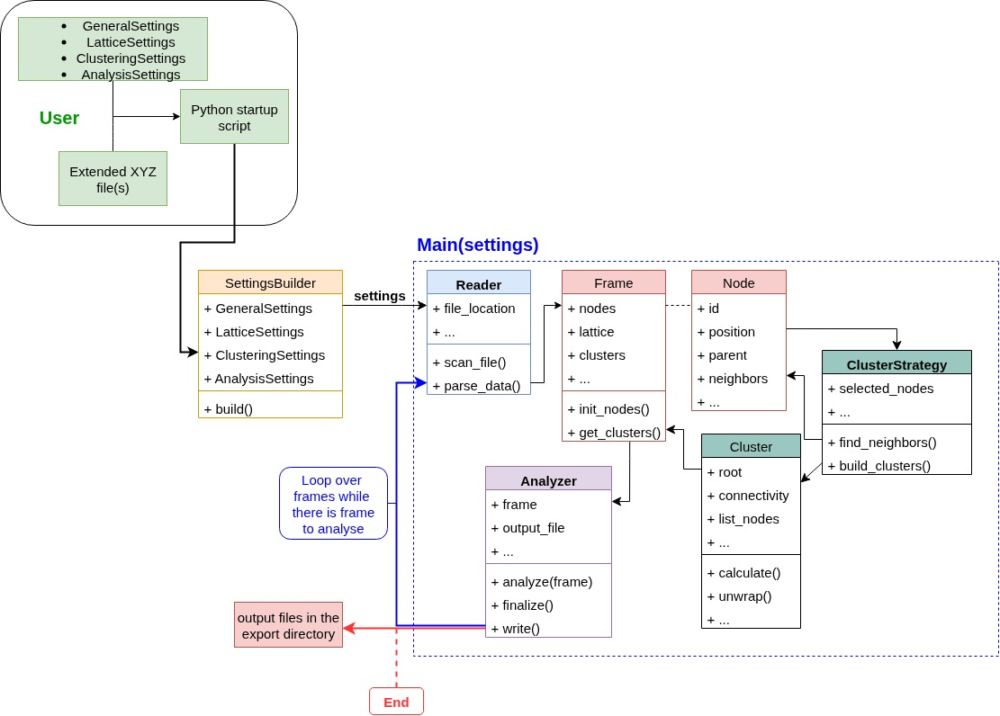

.. _getting_started:

Getting Started
===============

This section will guide you through the initial setup and usage of Nexus-CAT.

<div align="center">

</div>

Nexus follows a modular, configuration-driven workflow that separates user input from the core analysis pipeline. The framework processes trajectory files through distinct stages: configuration, data reading, frame analysis, clustering, and output generation.

### Workflow Overview

The analysis pipeline consists of five main stages:

#### 1. Configuration Setup

The workflow begins with the user defining analysis parameters through configuration objects:

- **GeneralSettings**: Project metadata, file locations, frame ranges, and verbosity
- **LatticeSettings**: Simulation box parameters and periodic boundary conditions
- **ClusteringSettings**: Clustering criterion, connectivity patterns, cutoff distances, and coordination constraints
- **AnalysisSettings**: Selection of metrics to compute (cluster sizes, gyration radii, percolation probabilities, etc.)

These settings are assembled using the `SettingsBuilder` pattern:

```python
from nexus import SettingsBuilder, main
import nexus.config.settings as c

settings = (
    SettingsBuilder()
    .with_general(general_settings)
    .with_lattice(lattice_settings)
    .with_clustering(clustering_settings)
    .with_analysis(analysis_settings)
    .build()
)
```

#### 2. File Reading and Frame Indexing

The `Reader` component (automatically selected based on file format) performs two operations:

- **Scanning**: The `scan_file()` method indexes the trajectory file, recording byte offsets and metadata (number of atoms, lattice parameters) for each frame
- **Parsing**: The `parse_data()` method extracts atomic positions and element symbols for specific frames on-demand

Supported formats include extended XYZ and LAMMPS dump files. The reader implements lazy loading—frames are parsed only when needed, minimizing memory usage for large trajectories.

#### 3. Frame Initialization

Each parsed frame creates a `Frame` object containing:

- **nodes**: List of `Node` objects representing atoms with positions, symbols, and connectivity
- **lattice**: 3×3 lattice matrix defining the simulation box
- **clusters**: Initially empty; populated during clustering

The `init_nodes()` method converts raw atomic data into `Node` objects, assigning unique IDs and initializing parent pointers for the union-find algorithm.

#### 4. Cluster Identification

The `ClusterStrategy` component (selected based on `criterion` in settings) identifies clusters through three steps:

**a. Neighbor Finding**
- Computes pairwise distances using periodic boundary conditions
- Identifies neighbors within specified cutoff distances
- Builds neighbor lists for each node

**b. Cluster Building**
- Applies the union-find algorithm to connect nodes meeting connectivity criteria
- For **distance criterion**: Connects nodes of specified types within cutoff distance
- For **bond criterion**: Connects nodes sharing a bridging atom (e.g., Si-O-Si linkages)
- For **coordination criterion**: Adds coordination number constraints
- For **shared criterion**: Requires minimum number of shared neighbors

**c. Cluster Property Calculation**
- Unwraps node positions across periodic boundaries
- Computes center of mass, radius of gyration, and percolation status
- Assigns cluster IDs and connectivity descriptors

The `get_clusters()` method returns the complete list of identified clusters for the frame.

#### 5. Analysis and Output

The `Analyzer` component processes clusters through multiple analyzers in parallel:

- Each analyzer (e.g., `AverageClusterSizeAnalyzer`, `PercolationProbabilityAnalyzer`) implements the `analyze(frame)` method
- Analyzers accumulate statistics across frames
- The `finalize()` method computes ensemble averages and standard deviations
- The `write()` method outputs results to CSV files in the export directory

### Frame Processing Loop

The main execution loop iterates over the specified frame range:

```python
for frame_id in range(start_frame, end_frame):
    # Parse frame data
    frame = reader.parse_data(frame_id)
    
    # Initialize nodes
    frame.init_nodes()
    
    # Find clusters
    strategy.find_neighbors()
    clusters = strategy.build_clusters()
    frame.clusters = clusters
    
    # Analyze frame
    for analyzer in analyzers:
        analyzer.analyze(frame, connectivities)
```

After all frames are processed, analyzers finalize results and write output files to the export directory.

### Output Files

Nexus generates multiple output files depending on the analysis settings:

- **Cluster configurations**: Extended XYZ files with unwrapped atomic positions (`unwrapped_clusters/`)
- **Bond files**: Connectivity information for visualization (`.bonds` format)
- **Analysis data**: CSV files with statistics (e.g., `average_cluster_size.dat`, `percolation_probability.dat`)
- **Logs**: Execution record with version and settings (`log.txt`)
- **Performance metrics**: Timing and resource usage data (`performance_*.json`)

### Key Design Features

**Modularity**: Each component (reader, strategy, analyzer) operates independently, allowing easy extension with new file formats, clustering algorithms, or analysis metrics.

**Lazy Loading**: Frames are parsed on-demand rather than loading the entire trajectory into memory, enabling analysis of multi-gigabyte files.

**Factory Patterns**: `ReaderFactory`, `StrategyFactory`, and `AnalyzerFactory` automatically select appropriate implementations based on configuration, hiding complexity from the user.

**Generator-Based Parsing**: The `parse()` method yields frames one at a time, supporting streaming workflows for arbitrarily long trajectories.

**Reproducibility**: Complete settings and version information are logged with each analysis run, ensuring results can be regenerated.

***

This workflow design prioritizes **flexibility** (multiple clustering criteria and analysis metrics), **performance** (JIT-compiled geometry functions, efficient file indexing), and **scalability** (memory-efficient frame processing, parallel-ready architecture).

[1](https://github.com/jperradin/nexus/blob/main/assets/workflow-Nexus.jpg../assets/workflow-Nexus.jpg)


### Quick Start Example

1.  **Prepare a trajectory file** in the `Extended XYZ` format. The trajectory file must have the following format:

    ```plaintext
    1008
    Lattice="21.3850 0.0 0.0 0.0 21.3850 0.0 0.0 0.0 21.3850"
    O 4.81534 7.79666 13.4134
    O 15.3218 18.7985 16.3627
    ...
    Si 16.9122 10.503 3.05908
    Si 5.69312 8.20448 18.6908
    ...
    ```
    Nexus-CAT reads lattice properties directly from the trajectory file.

2.  **Create a python script** and import the necessary modules:

    ```python
    from nexus import SettingsBuilder, main
    import nexus.config.settings as c
    ```

3.  **Set up the general configuration settings**:

    ```python
    config_general = c.GeneralSettings(
        project_name="SiO2",
        export_directory="examples/exports",
        file_location="path/to/trajectory.xyz",
        range_of_frames=(0, 10),
        apply_pbc=True,
        verbose=True,
        save_logs=True,
        save_performance=True
    )
    ```

4.  **Configure lattice settings**:

    ```python
    config_lattice = c.LatticeSettings(
        apply_custom_lattice=False,
    )
    ```

5.  **Set up the clustering settings**:

    ```python
    config_clustering = c.ClusteringSettings(
        criterion="bond",
        node_types=["Si", "O"],
        node_masses=[28.0855, 15.9994],
        connectivity=["Si", "O", "Si"],
        cutoffs=[c.Cutoff(type1="Si", type2="Si", distance=3.50),
                 c.Cutoff(type1="Si", type2="O", distance=2.30),
                 c.Cutoff(type1="O", type2="O", distance=3.05)],
        with_coordination_number=True,
        coordination_mode="O",
        coordination_range=[4, 6],
        with_alternating=True,
        with_printed_unwrapped_clusters=True,
        print_mode="connectivity"
    )
    ```

6.  **Configure the analysis settings**:

    ```python
    config_analysis = c.AnalysisSettings(
        with_all=True,
    )
    ```

7.  **Build the settings object** using the builder pattern and run the analysis:

    ```python
    settings = (SettingsBuilder()
        .with_general(config_general)
        .with_lattice(config_lattice)
        .with_clustering(config_clustering)
        .with_analysis(config_analysis)
        .build()
    )

    main(settings)
    ```

8.  **Run the script** and check the results in the export directory.

    ```bash
    python your_script.py
    ```